# Why the need for Best Practices?

## Genesis

-   **Digital Platforms for Disease Surveillance and Control: Best Practices from Asia** (DMgtAsia)
-   Bridge the gap between public health and technology
-   Post COVID-19: Need for data-driven decision-making at scale
-   Limited training capacity in LMICs in this area
-   Develop standardized, reproducible best practices that can be adapted globally

## Why Best Practices Matter 

<br> 

-   Provide Guidance to navigate the complexities of data science
-   Plethora of information on Data Science available, without clear direction
-   Handholding in your learning journey, not learning in isolation
-   Steep Learning Curve: structured pathways reduce frustration

---

## Why Best Practices Matter (cont.)

<br>

-   Inevitable use of AI: a Human in the Loop approach
-   Set you apart from the crowd: credibility through proven methods
-   Consistency among trainers, to maintain quality

## What are these Best Practices? 

<br>

-   **Based on a Scientific Approach**
    -   Grounded in epidemiological principles and data science methodology
    -   Validated in the real-world and through peer-reviewed literature

<br>

-   **Tried & Tested for over a decade of working in this Area**
    -   SCTIMST: Public Health Technologies Training Modules
    -   Resource Faculty: Years of collective experience in teaching

## What are these Best Practices?

<br>

-   **Walk the Talk**
    -   We actively use these practices in our day-to-day teaching & research
    -   We make conscious decisions to use these best practices in our own work
    -   Self critique and Support one another

<br> 

-   **Worked for over 300+ learners from over 75+ institutions**
    -   Medical professionals, informaticians, data scientists, healthcare workers
    -   Recognised a Best Practice in Public Health Teaching (IAPSMCON-2024)
    -   Multiple Verticals 

## What are these Best Practices? 

<br> 

-   **State of the Art tools**
    -   R: Developed by and for statisticians and epidemiologists
    -   `tidyverse`: Industry-standard for reproducible workflows
    -   Quarto: A Language Agnostic Dynamic Authoring Framework

<br> 

-   **Industry Standard**
    -   Aligns with international best practices
    -   Recognized by WHO, CDC, UNICEF, and global health agencies
    -   Facilitates collaboration with other research teams

# Best Practice #1: <br>  Philosophical Underpinnings

## Core Philosophies

::: {.fragment}
> **Data Science is a Tool for Social Good, Not an End in Itself**
:::

::: {.fragment}
> **Data for Better Lives**
:::

::: {.fragment}
> **3D Commission Recommendations**
:::

::: {.fragment}
> **FAIR** Data Principles
:::

::: {.fragment}
-   The Public Health Lens
-   Bridging Disciplines
:::

# Best Practice #2: <br>  Reproducibility

## What is Reproducibility

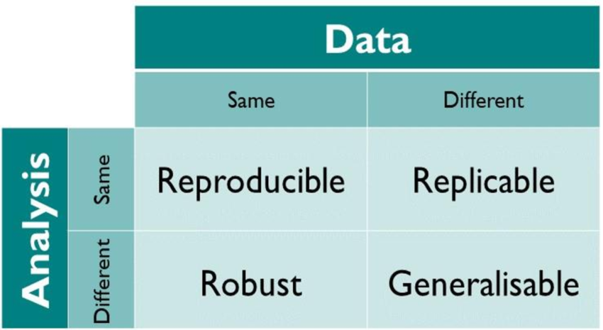{fig-align="center"}

## FAIR Principles and Reproducibility

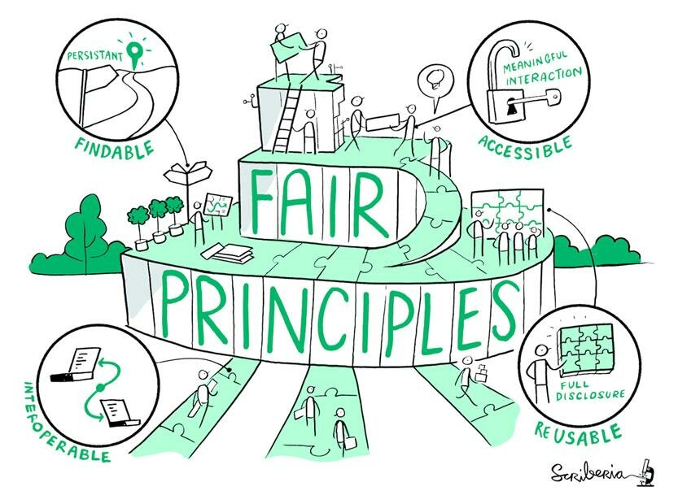{fig-align="center"}

## FAIR and CARE

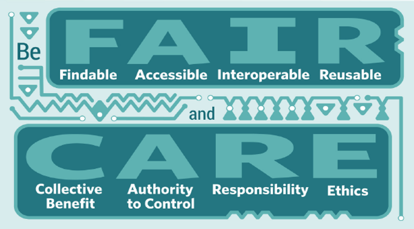{fig-align="center"}

## FAIR Principles and Reproducibility

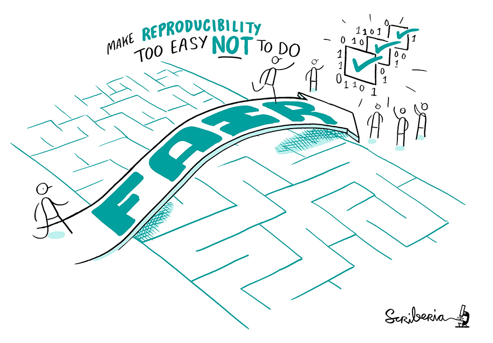{fig-align="center"}

## Reproducible Workflows

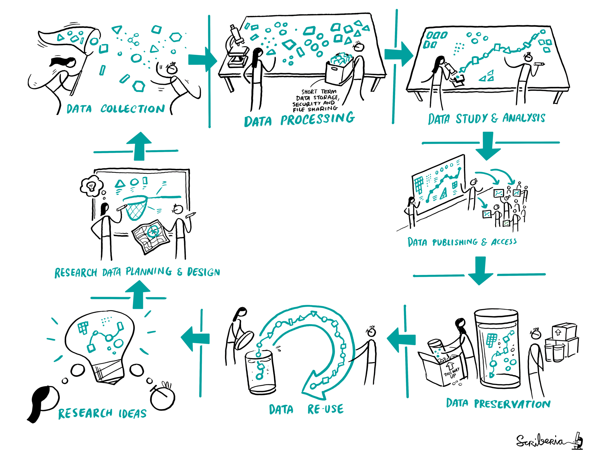{fig-align="center"}

## The Reproducibility Spectrum

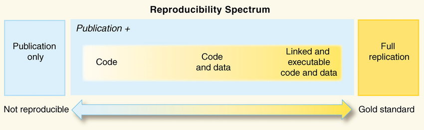{fig-align="center"}


# Best Practice #3: <br>  Tool Choices

## Why R (and not other tools)? 

<br>

:::{.incremental}
-   Born from S language, specifically designed for statistical analysis
-   The global epidemiology and biostatistics community uses R
-   Hundreds of packages for health research
-   Open-source: you can see how calculations are done
-   Windows, Mac, Linux: runs even on older computers
-   Thousands of tutorials, Stack Overflow answers

:::

## R vs. Alternatives for Health Research

::: {.incremental}

| Tool | Strength | Limitation |
|------------------|--------------------------|----------------------------|
| **Excel** | Accessible, intuitive | Prone to errors, not reproducible |
| **SPSS/Stata** | User-friendly GUI | Expensive, less transparent, limited Customization Options |
| **Tableau/Jamovi** | Less Expensive than others | Limited Analysis Options |
| **Python** | General-purpose, flexible | Steeper learning curve for epidemiologists |
| **R** | Purpose-built for stats, reproducible, free | Slightly steeper initial learning curve |

:::

## The R Ecosystem 

<br>

-   **R Programming Language**: The Engine!
-   **RStudio IDE**: The Dashboard!
-   **Quarto/R Markdown**: Combine narrative text + code + output (reproducible documents)
-   **`tidyverse`**: Collection of R packages designed for modern data workflows

# Best Practice #4: <br>  Literate Programming

## What is Literate Programming?

> **Code + Narrative + Output = Single Document**

> **Start with a DATA DICTIONARY**

### The Concept (Donald Knuth, 1984)

-   Programs should be written for people to read, not just for machines to execute
-   Mix explanation with code
-   Generate analysis reports that are reproducible and transparent

## In Practice: Quarto/R Markdown  {.smaller}


Write it once. The document weaves narrative, code, and output together:

::::: {.columns}

:::: {.column width="55%"}
::: {.codewindow .quarto}
attack_rates.qmd

````markdown
# Age-Stratified Attack Rates

Attack rates by age group for the Sholayur Acute Gastroenteritis outbreak.

## Data Preparation

```{{r}}
age_data <- read_csv(here("data", "family_members.csv")) |>
  mutate(age_group = factor(age_group,
    levels = c("0-4", "5-17", "18-64", "65+")))
```

## Results

```{{r}}
age_data |>
  group_by(age_group) |>
  summarise(
    n_symptomatic = sum(symptomatic, na.rm = TRUE),
    n_total       = n(),
    attack_rate   = n_symptomatic / n_total * 100
  )
```
````
:::
::::

:::: {.column width="45%"}

:::{.fragment}

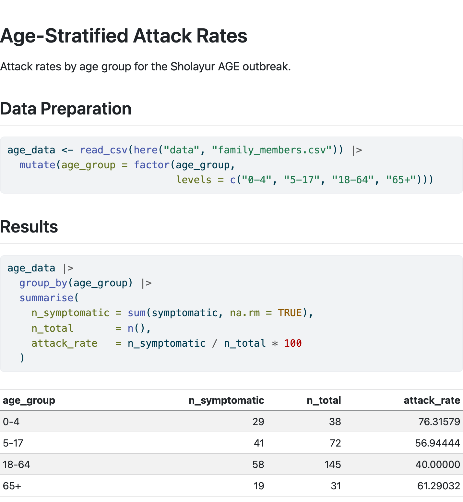{fig-align="center" width="88%"}
:::
::::

:::::


# Best Practice #5: <br> Structure & Consistency

## Project Organization  {.smaller}

**A well-organized project is a well-organized mind.**

### Standard Directory Structure

```         
my_analysis/
├── README.md              # Project overview
├── data/
│   ├── raw/              # Never modify
│   │   └── gastroenteritis_sholayur.csv
│   ├── processed/        # Cleaned, validated data
│   │   └── gastroenteritis_clean.csv
│   └── data_dictionary.md
├── scripts/
│   ├── 01_data_cleaning.R
│   ├── 02_descriptive_analysis.R
│   └── 03_inferential_stats.R
├── results/
│   ├── tables/
│   ├── figures/
│   └── outputs/
├── reports/
│   ├── outbreak_report.qmd
│   └── outbreak_report.html
├── docs/
│   ├── protocol_v3.pdf
│   └── iec_approval.pdf
└── .gitignore
```

## Naming Conventions

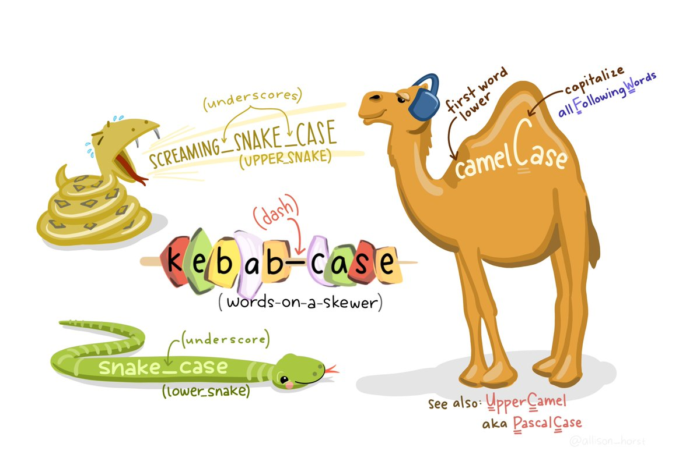{fig-align='center'}

## Naming Conventions 

-   **Scripts**:
    -   `stroke_data_exploration.R`, `dengue_data_visualization.R`, instead of `scrpit1`, `script2`
    -   Can consider `01_`, `02_` ... for indicating sequential execution

---

## Naming Conventions (cont.)

:::{.fragment}
-   **Variables**:
    -   `age_group` not `ageGrp` or `AgGr` (consistency matters)
    -   Do not start variable names with numbers
    -   Consider adding prefix/suffix to indicate variable type (`state_fct`, `age_group_chr`)
    -   `dem_q1`, `dem_q2`, `dem_q3`, `health_financing_q1`, `health_financing_q2`
    -   Add variable labels if necessary using the `labelled` package

:::

----

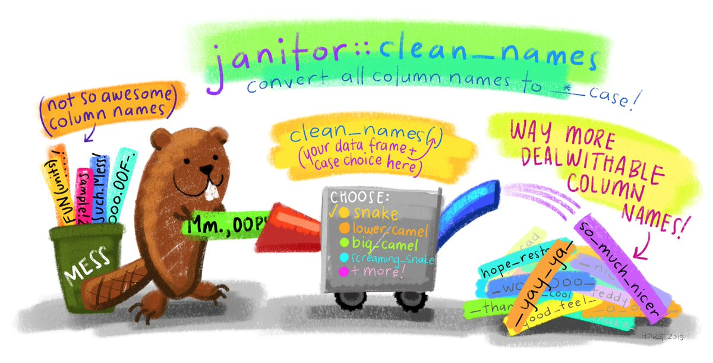{fig-align='center'}

## Naming Conventions

-   **Files**:
    -   `outbreak_analysis_2025_11_07.R` (date in YYYY_MM_DD format)
-   **Dates**:
    -   Always ISO 8601 (YYYY-MM-DD) in code for consistency across regions
    -   Use `_date` suffix for indicating dates
-   **Versions**:
    -   Use version for better management `outbreak_analysis_2025_11_07_v2.R` instead of `outbreak_analysis_2025_11_07_final_final.R`

----

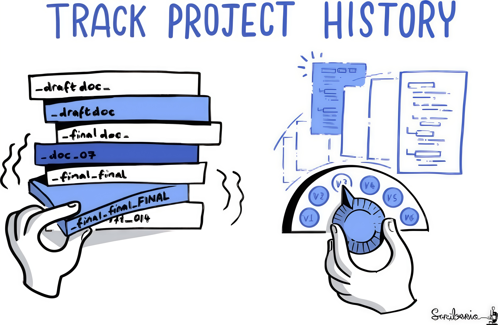

----

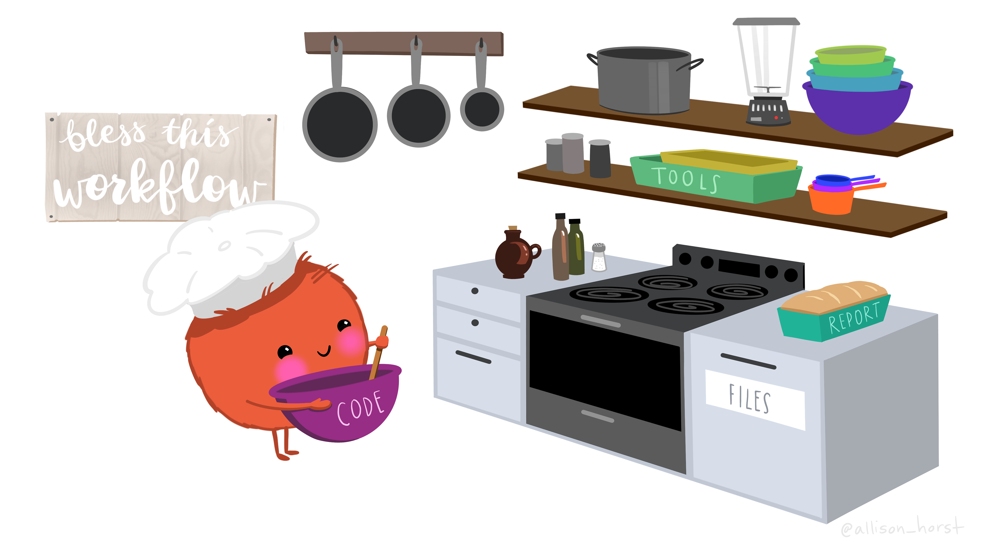{fig-align='center'}

# Best Practice #6: Coding Style

## Why Coding Style Matters  {.smaller}

**Code is read 10x more often than it's written.**

### The Google R Style Guide Approach

``` r
# GOOD: Clear, readable, consistent
calculate_attack_rate <- function(symptomatic_count, total_count) {
  # Calculate attack rate as percentage
  # Args:
  #   symptomatic_count: Number of symptomatic individuals
  #   total_count: Total population at risk
  # Returns:
  #   Attack rate as percentage (0-100)
  
  if (total_count == 0) {
    return(NA)
  }
  
  (symptomatic_count / total_count) * 100
}

# BAD: Unclear naming, no comments
ar <- function(s, t) {
  (s/t)*100
}
```


## Example: Good vs. Bad

:::{.panel-tabset}

### Bad

``` r
d<-read.csv('file.csv')
d$ag<-cut(d$a,c(0,5,18,65,150))
d$ar<-ifelse(d$d==1,1,0)*100/d$t
```

### Good
``` r
# This script creates age_group variable from age column

# Load Packages
pacman::p_load(tidyverse, here)

# Load Data
age_data <- read_csv(here("data", "age_sholayur.csv"))

# Create age groups with meaningful labels
age_data <- age_data |>
  mutate(
    age_group = case_when(age < 5 ~  "0-4",
                          age < 18 ~  "5-17",
                          age < 65 ~  "18-64",
                          age >= 65 ~  "65+")
        ) |>
  mutate(
    age_group = factor(age_group, 
                        levels = c("0-4", "5-17", "18-64", "65+"))) |>
  )
```
:::


# Best Practice #7: Tidy Philosophy

## What is "Tidy Data"?

**A standardized way to structure datasets for analysis.**

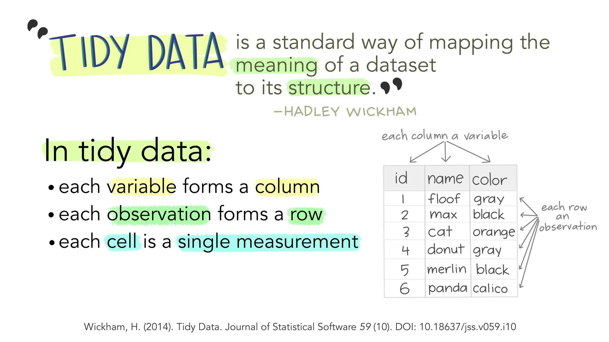{fig-align='center'}

## Hadley Wickham's Principles

1.  **Each variable is a column**
2.  **Each observation is a row**
3.  **Each value has its own cell**

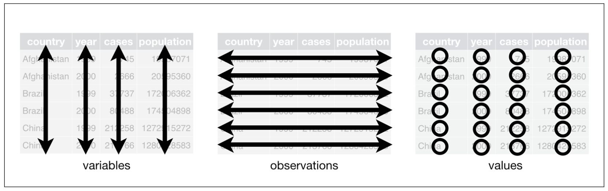{fig-align='center'}

----

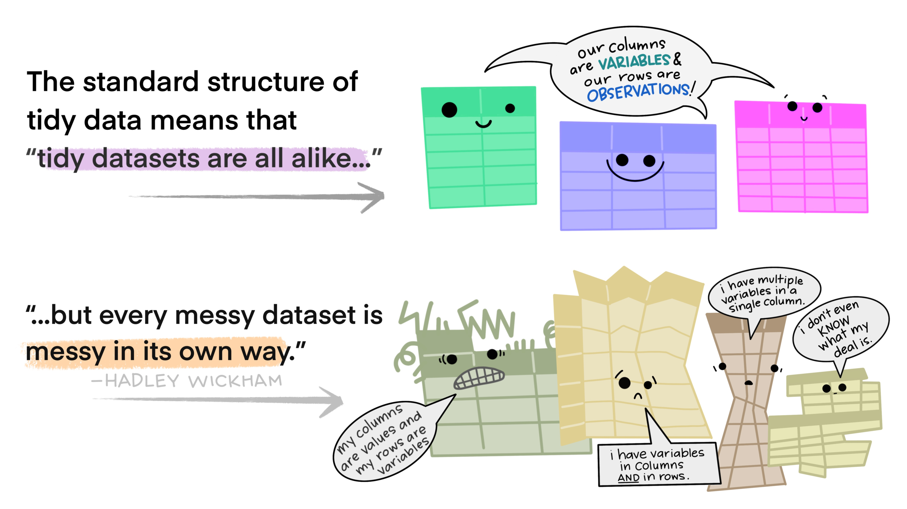{fig-align='center'}

----

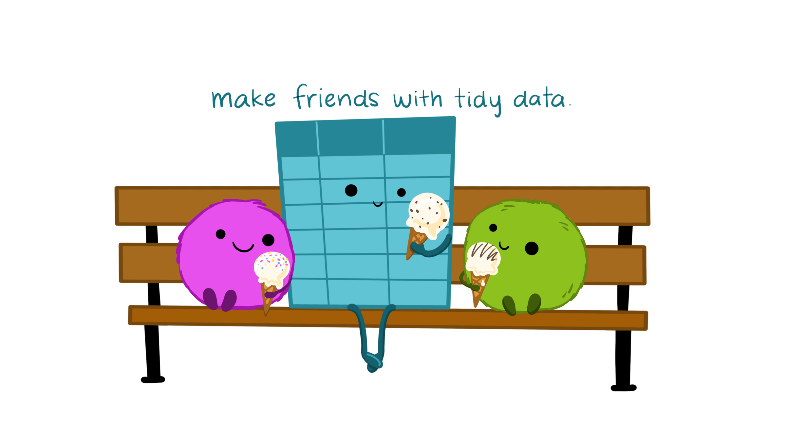{fig-align='center'}


## Why Tidy Data Matters for Your Analysis

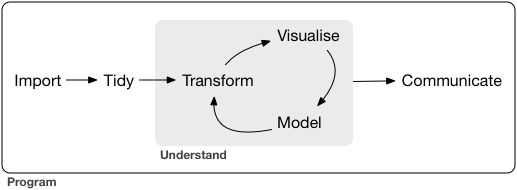{fig-align='center'}

::: aside
Source: *Hadley Wickham and Garrett Grolemund. 2017. R for Data Science: Import, Tidy, Transform, Visualize, and Model Data (1st. ed.). O’Reilly Media, Inc.*
:::

## Converting Messy to Tidy

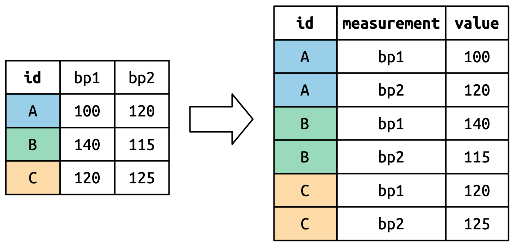{fig-align='center'}

# Best Practice #8: Open to Learning

## Continuous Improvement Mindset

**Data Science and Public Health are Evolving Fields**

- Embrace Change, Manage It Thoughtfully
- Avoid Common Pitfalls

---

## Continuous Improvement Mindset (cont.)

### Learning Strategies for Trainers

-   Read widely
-   Experiment safely
-   Document lessons learned
-   Peer review
-   Stay grounded


# Best Practice #9: Prompting AI Well

## AI is Now Part of the Workflow 

**The use of AI is inevitable. Using it well is a choice.**

-   It writes code, drafts text, and explains errors in seconds
-   But it is fluent and confident even when it is wrong
-   What you get back depends on the quality of what you ask for
-   Stay the Human in the Loop: AI assists, you decide

::: {.fragment}
> The prompt, not the model, decides whether the output is any good.
:::

## Four prompting strategies

| Strategy | What it is | Best for |
|---|---|---|
| **Zero-shot** | Just ask, no examples | Descriptive stats |
| **Explicit** | Numbered steps incl. checks | Workflows that mustn't skip steps |
| **Chain-of-thought** | "Think step by step" | Auditing the reasoning |
| **Hybrid** | Steps + reasoning + format | **Inferential — the default** |

::: {.fragment}
**Rule of thumb:** descriptive → zero-shot; inferential → **hybrid**.
:::


## Example: Vague vs. Briefed

:::{.panel-tabset}

### Vague

``` text
Analyse this data and run a t-test.
```

Skips the assumptions, guesses the design, picks a test for you.

### Briefed

``` text
You are a biostatistician.
<context> two-arm trial, 20 patients per arm,
outcome is systolic blood pressure </context>
<data> ... </data>

1. Test for normality and equal variance.
2. Choose the correct test and justify it.
3. Report a table: statistic, df, p-value, 95% CI.
4. Interpret in plain language.
```
:::

## Iterate, Do Not Perfect {.smaller}

-   The first answer is the average answer; the second is usually better
-   Refine in small steps rather than crafting one perfect prompt
-   Ask for alternatives and for the reasoning, not just the result
-   Resist sycophancy: ask the model to critique, not to confirm
    -   "Grade this analysis against these criteria" beats "this looks fine, right?"

## Prompting is Part of Your Methods 

The same discipline as Reproducibility (#2) and Literate Programming (#4).

-   **Save the prompts** that worked, inside the project (`prompts/`)
-   **Record** the model, its version, and the date
-   **Set a low temperature** for analysis you must reproduce
-   **Validate every AI-generated number in R** before it enters a report
-   **Never paste identifiable patient data** into a cloud LLM

::: {.fragment}
> Problem formulation beats perfect wording. Think first, prompt second.
:::

----

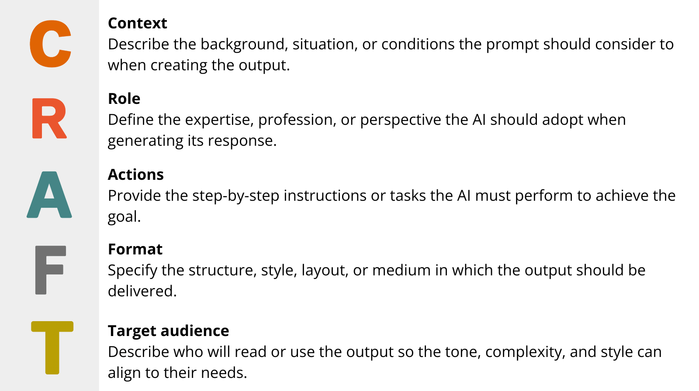{fig-align='center'}

----

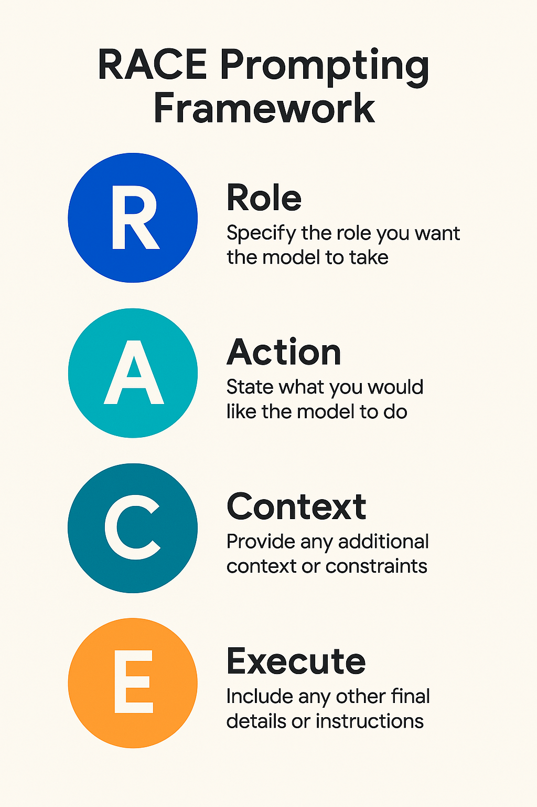{fig-align='center'}

----

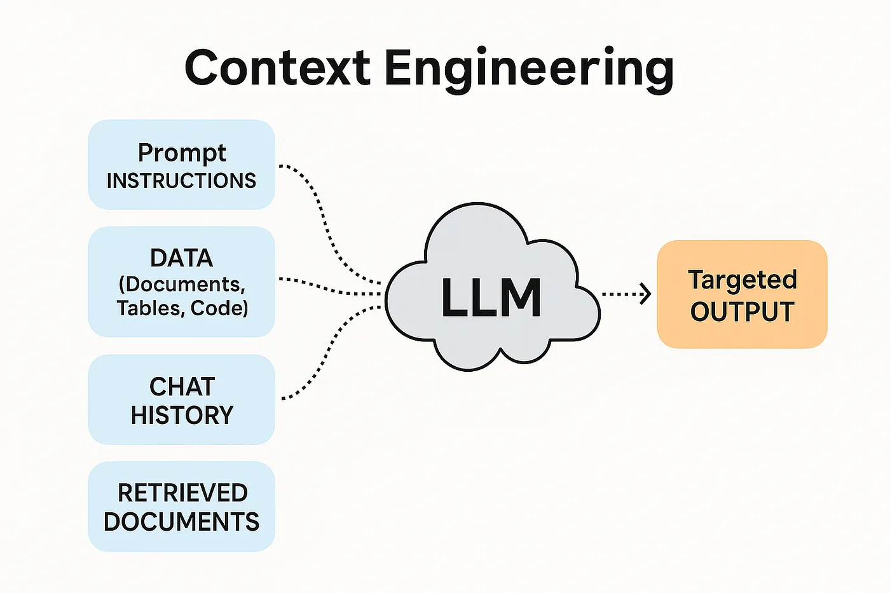{fig-align='center'}

# Best Practice #10: Share/Collaborate/Acknowledge

----

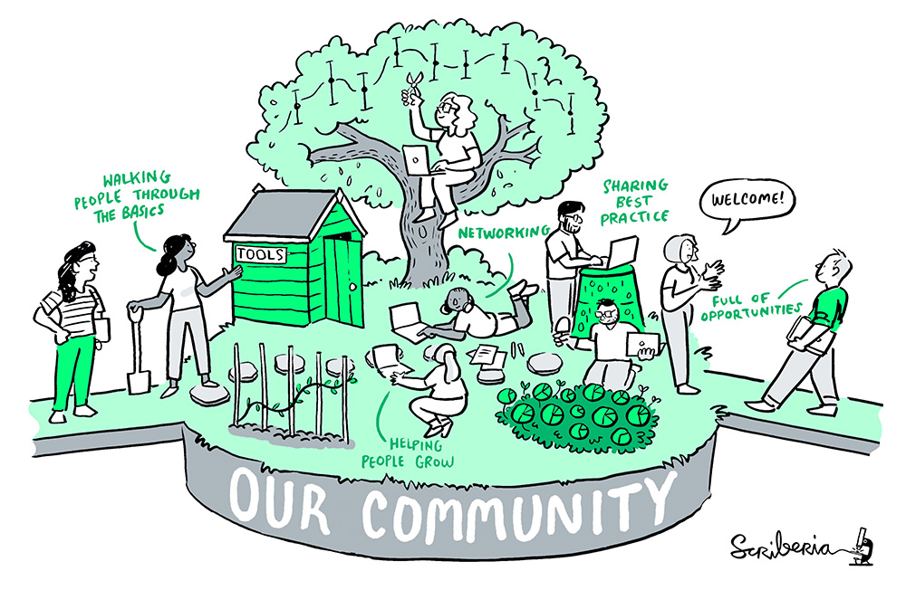{fig-align='center'}

## Benefits of Sharing and Acknowledging

- No single person has all the expertise needed in public health data science.
- Opportunity to learn from peers
- Improves your credibility & citations
- Opens avenues for collaboration
- Self Marketing!

# Questions?

# Thank You

