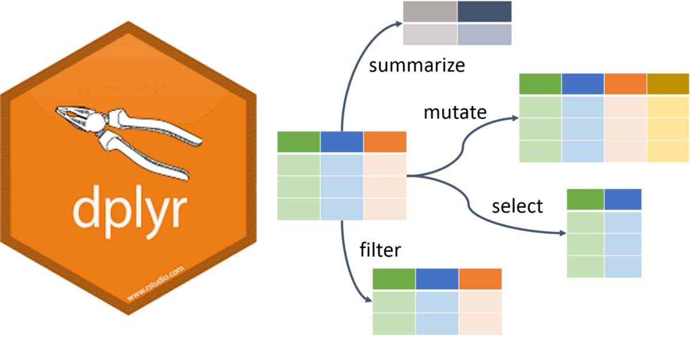
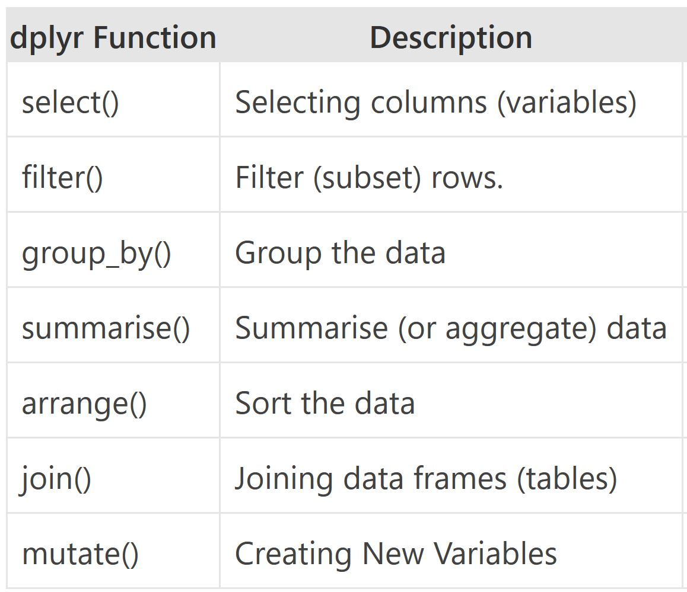
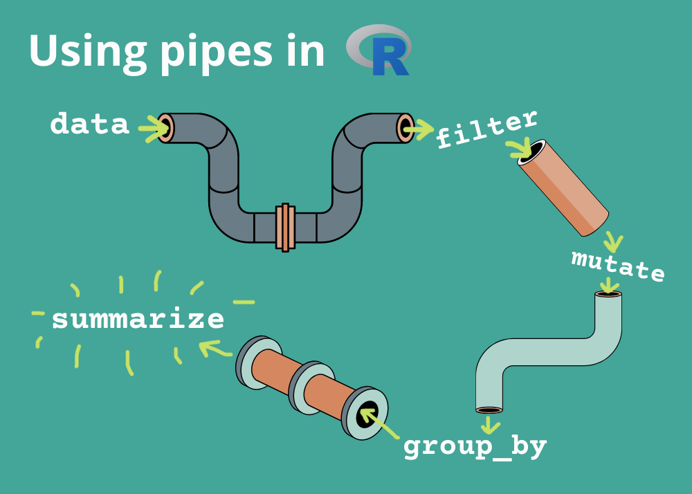
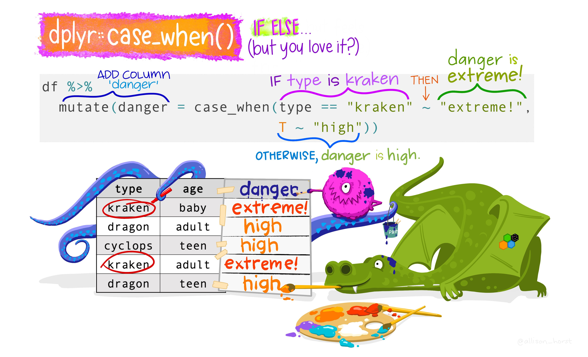
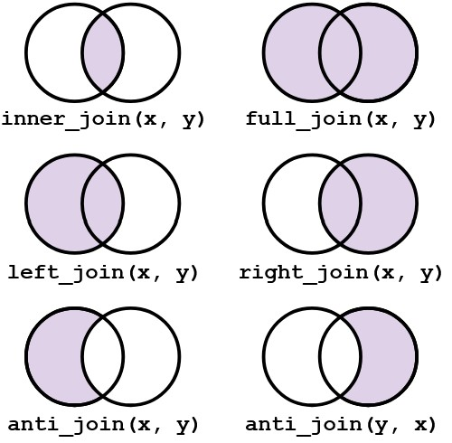
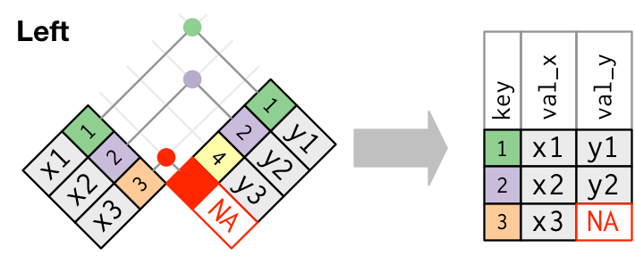
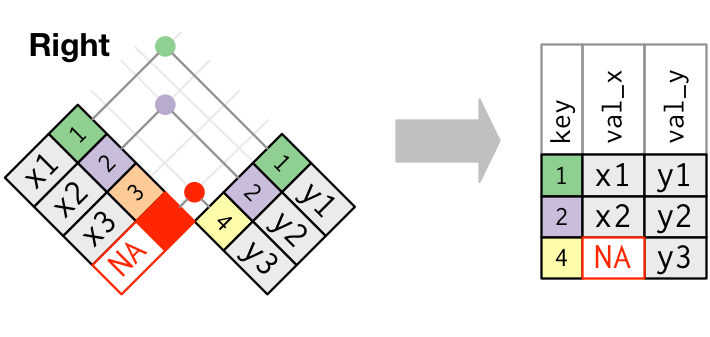
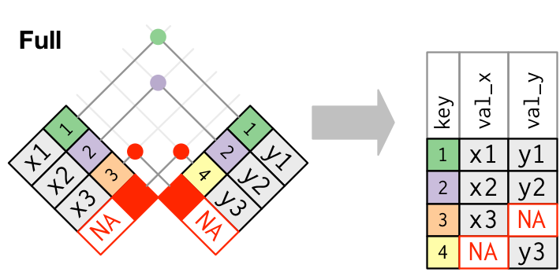
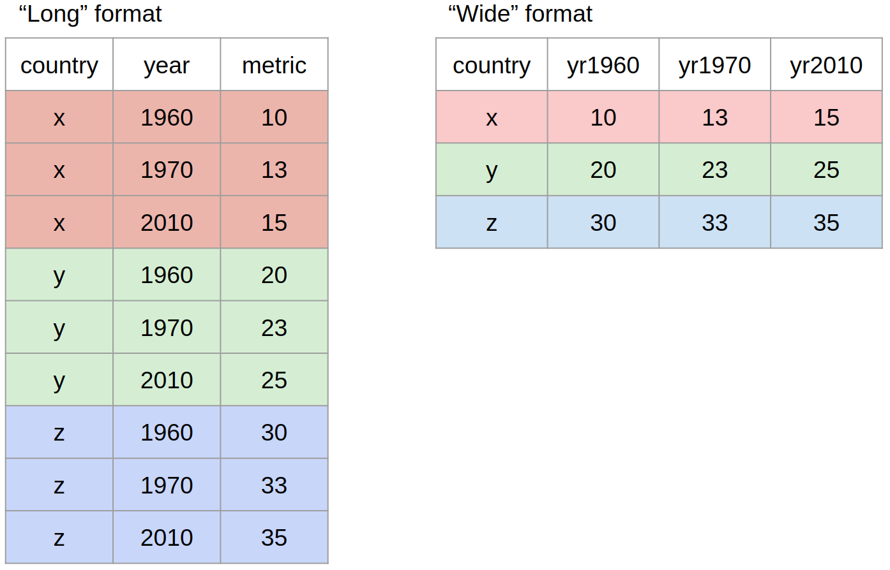

## What is Exploratory Data Analysis?

::: {.columns}

::: {.column width="60%"}

- **EDA** is the critical first step.

- **EDA** is a state of mind.

- **EDA** is exploring your ideas.

- **EDA** has no strict rules.

- **EDA** helps understand your data.

- **EDA** is an iterative cycle.

- **EDA** is a creative process.

:::

::: {.column width="10%"}

:::

::: {.column width="30%"}


:::
:::


## Definition of EDA

> *"detective work – numerical detective work – or counting detective work – or graphical detective  work"*

- **Tukey,  1977** *Page 1, Exploratory Data Analysis*


## How to do EDA?

- The easiest way to do **EDA** is to use questions as tools to guide your investigation.

- **EDA** is an important part of any data analysis, even if the questions are known already.


## Asking the right questions

Key to asking **_quality_** questions is to generate a large **_quantity_** of questions.

It is difficult to ask revealing questions at the start of the analysis.

But, each new question will expose a new aspect and increase your chance of making a discovery.

## What Questions to ask?


- What type of variation occurs within your variables?

- What type of covariation occurs between your variables?

- Whether your data meets your expectations or not.

- Whether the quality of your data is robust or not.


## Steps of a data analysis project {.smaller}


::: columns
::: {.column  width="40%"}

- Preparing Tidy Data
  - Data Cleaning
  - Data Wrangling

- Data Exploration
  - Transformation
  - Visualization

- Statistical Analysis
- Prepare Results
- Draw Inferences
- Report Findings

:::
::: {.column  width="60%"}
{width='60%' fig-align='center'}
:::
:::


## Data Wrangling in R

### `dplyr` Package

::: {.columns}

::: {.column width="60%"}
The `dplyr` is a powerful R-package to manipulate, clean and summarize unstructured data.

In short, it makes data exploration and data manipulation easy and fast in R.
:::

::: {.column width="40%"}


:::

:::

## Verbs of the `dplyr`

- There are many verbs in `dplyr` that are useful.




## Using the pipe operator (`|>` or `%>%`)

{fig-align="center" width='100%'}


## Let us load some data


```{r}
#| include: false

options(tidyverse.quiet = TRUE)
# keep printed tibbles narrow and short so they fit one slide
options(width = 70, pillar.print_min = 5, pillar.print_max = 5)
library(tidyverse)
library(here)
library(rio)

filepath <- here("data", "who_tubercolosis_data.csv")

tb <- filepath |>
  import(setclass = "tibble")
```

::: {.panel-tabset}


### Code

```r
library(tidyverse)
library(here)
library(rio)

filepath <- here("data", "who_tubercolosis_data.csv")

tb <- filepath |>
  import(setclass = "tibble")

tb
```


### Output

```{r}
#| echo: false

tb |>
  print(width = 70)
```
:::


## Take a Quick Look at the data

::: {.panel-tabset}


### Code
```r
tb |>
  glimpse()
```


### Output

```{r}
#| echo: false

tb |>
  glimpse(width = 70)
```

:::

## Check the first few rows


```r
tb |>
  head()
```


```{r}
#| echo: false

tb |>
  head() |>
  print(width = 70)
```


## Check the dimensions and the column names


```{r}
#| echo: true

tb |>
  dim()

tb |>
  names()
```


## Lets find the unique countries in the bottom 50 rows of the dataset


::: {.panel-tabset}


### Without `|>`

```{r}
#| echo: true

unique(tail(tb, n = 50)$country)

```

###

### With `|>`

```{r}
#| echo: true

tb |>
  tail(50)  |>
  distinct(country)
```

:::


## `distinct()` and `count()`

The `distinct()` function will return the distinct values of a column, while `count()` provides both the distinct values of a column and then number of times each value shows up.

::: {.columns}

::: {.column width="40%"}

```r
tb  |>
  distinct(who_region)
```

```{r}
#| echo: false

tb  |>
  distinct(who_region)
```


:::

::: {.column width="10%"}

:::


::: {.column width="50%"}
```r
tb  |>
  count(who_region)
```

```{r}
#| echo: false

tb  |>
  count(who_region)
```

:::
:::


## `arrange()`

The `arrange()` function does what it sounds like. It takes a data frame or tbl and arranges (or sorts) by column(s) of interest.

Use the `desc()` function to arrange by descending.


::: {.columns}

::: {.column width="35%"}

```r
tb |>
  count(who_region) |>
  arrange(n)
```

```{r}
#| echo: false

tb |>
  count(who_region) |>
  arrange(n)
```


:::

::: {.column width="5%"}

:::


::: {.column width="60%"}
```r
tb |>
  count(who_region) |>
  arrange(-n) # alt: arrange(desc(n))
```

```{r}
#| echo: false

tb |>
  count(who_region) |>
  arrange(-n)
```

:::
:::


## Logical Operators in R

::: {.columns}

::: {.column width="50%"}


- If you want to satisfy *all* of multiple conditions, you can use the "and" operator, `&`.

- The "or" operator `|` (the vertical pipe character, shift-backslash) will return a subset that meet *any* of the conditions.

:::

::: {.column width="50%"}


:::

:::

## `filter()`

- Rows with year 2015 and above


```r
tb|>
  filter(year >= 2015)
```

```{r}
#| echo: false

tb|>
  filter(year >= 2015) |>
  print(width = 70)
```

## `filter()`

- All entries for India

```r
tb|>
  filter(country == "India")
```


```{r}
#| echo: false

tb|>
  filter(country == "India")  |>
  print(width = 70)
```


## Filter by year and country

```r
tb |>
  filter(year >= 2015 & country == "India")
```

```{r}
#| echo: false

tb|>
  filter(year >= 2015 & country == "India")  |>
  print(width = 70)
```


## The `%in%` function

- To `filter()` a categorical variable for only certain levels, we can use the `%in%` operator.

- Let's see data from India, Nepal, Pakistan and Bangladesh First we will have to figure out how those are spelled in this dataset.

- Open the spreadsheet viewer and find out.

- We'll see a way to find them in code later on in the course.

----


```r
# Create the Indian Subcontinent Variable
indian_subcont <- c(
            "India",
            "Nepal",
            "Pakistan",
            "Bangladesh",
            "Afghanistan"
            )

# Filter using the %in% function
tb  |>
  filter(country %in% indian_subcont) |>
  count(country)

```

```{r}
#| echo: false

# Create the Indian Subcontinent Variable
indian_subcont <- c(
            "India",
            "Nepal",
            "Pakistan",
            "Bangladesh",
            "Afghanistan",
            "Sri Lanka"
            )

# Filter using the %in% function
tb  |>
  filter(country %in% indian_subcont) |>
  count(country)
```


##   `summarize()`

- The `summarize()` function summarizes multiple values to a single value.

- On its own the `summarize()` function doesn't seem to be all that useful.

The dplyr package provides a few convenience functions called `n()` and `n_distinct()` that tell you the number of observations or the number of distinct values of a particular variable.

`summarize()` is the same as `summarise()`


## `summarize()`  in Action


```{r}
#| echo: true

tb|>
  summarize(n = n(),
            n_countries = n_distinct(country),
            n_years = n_distinct(year),
            mean_hiv_percent = mean(hiv_percent, na.rm = TRUE),
            sd_hiv_percent = sd(hiv_percent, na.rm = TRUE))
```


## `group_by()`

- We saw that `summarize()` isn't that useful on its own. Neither is `group_by()`.

- All this does is takes an existing data frame and converts it into a grouped data frame where operations are performed by group.

- The real power comes in where `group_by()` and `summarize()` are used together. First, write the `group_by()` statement. Then pipe the result to a call to `summarize()`.

## `group_by()` and `summarize()`

```{r}
#| echo: true

tb |>
  group_by(who_region)  |>
  summarize(n_countries = n_distinct(country),
            mean_inc = mean(incidence_100k, na.rm = TRUE),
            sd_inc = sd(incidence_100k, na.rm = TRUE)) |>
  ungroup()
```


## `mutate()`
- Mutate creates a new variable or modifies an existing one.

{fig-align="center"}

## `if_else()`

Lets create a column called `ind_sub` if the country is in the Indian Subcontinent.


```{r}
#| echo: true

tb |>
  mutate(ind_sub = if_else(country %in% indian_subcont,
                              "Indian Subcontinent", "Others")) |>
  select(country, ind_sub) |>
  filter(ind_sub != "Others") |>
  distinct()
```


## `group_by()` and `summarize()`

```{r}
#| echo: true

tb |>
  mutate(ind_sub = if_else(country %in% indian_subcont,
                              "Indian Subcontinent", "Others")) |>
  group_by(ind_sub)  |>
  summarize(n_countries = n_distinct(country),
            mean_inc = mean(incidence_100k, na.rm = TRUE),
            sd_inc = sd(incidence_100k, na.rm = TRUE)) |>
  ungroup()
```


## `case_when()`

Alternative of `if_else()`

{fig-align="center"}

## `if_else()` vs `case_when()`

Note that the `if_else()` function may result in slightly shorter code if you only need to code for 2 options.

For more options, nested `if_else()` statements become hard to read and could result in mismatched parentheses so `case_when()` will be a more elegant solution.


## `join()`

- Typically in a data science or data analysis project one would have to work with many sources of data.

- The researcher must be able to combine multiple datasets to answer the questions he or she is interested in.

- As with the other `dplyr` verbs, there are different families of verbs that are designed to work with relational data and one of the most commonly used family of verbs are the mutating joins.

----




## More on `join()`

- `left_join(x, y)` which combines all columns in data frame `x` with those in data frame `y` but only retains rows from `x`.

- `right_join(x, y)` also keeps all columns but operates in the opposite direction, returning only rows from `y`.

- `full_join(x, y)` combines all columns of `x` with all columns of `y` and retains all rows from both data frames.

- `inner_join(x, y)` combines all columns present in either `x` or `y` but only retains rows that are present in both data frames.


## Visual representation of the `left_join()`





## Visual representation of the `right_join()`





## Visual representation of the `full_join()`





## `pivot()`

Most often, when working with our data we may have to reshape our data from long format to wide format and back. We can use the `pivot` family of functions to achieve this task.


{fig-align="center"}


## Other Useful Functions
### `drop_na()`

The `drop_na()` function is extremely useful for when we need to subset a variable to remove missing values.

---

## Other Useful Functions (cont.)

### `select()`

While the `filter()` function allows you to return only certain rows matching a condition, the `select()` function returns only certain *columns*. The first argument is the data, and subsequent arguments are the columns you want.


## More Resources for `dplyr` {.smaller}


- The [Data Transformation cheatsheet](https://opensource.posit.co/resources/cheatsheets/data-transformation/) summarises the `dplyr` verbs on a single page.

- The [RStudio IDE cheatsheet](https://opensource.posit.co/resources/cheatsheets/rstudio-ide/) is a handy reference for the editor itself.

- [Posit Recipes](https://posit.cloud/learn/recipes) offers copy-paste solutions to common data-wrangling tasks.

- Review the [Tibbles](https://r4ds.had.co.nz/tibbles.html) chapter of the excellent, free [**_R for Data Science_ book**](http://r4ds.had.co.nz).

- Check out the [Transformations](https://r4ds.had.co.nz/transform.html) chapter to learn more about the `dplyr` package. Note that this chapter also uses the graphing package `ggplot2` which we have covered yesterday.

# Questions?

# Thank You!

